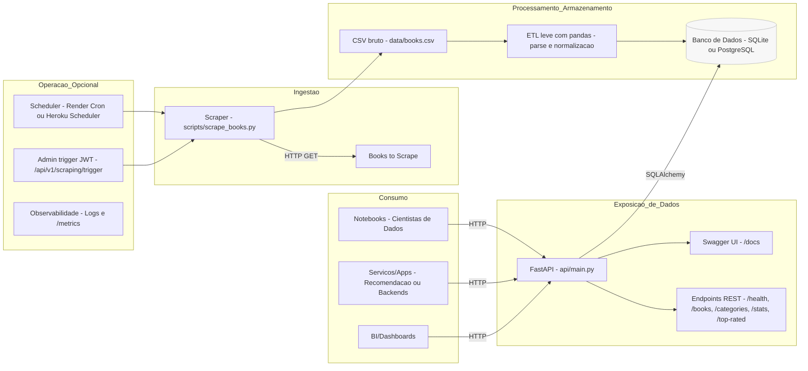

# 🧭 Plano Arquitetural — Books Public API

> Documento do item **5. Plano Arquitetural**: descreve o **pipeline (ingestão → processamento → API → consumo)**, a **arquitetura para escalabilidade**, **cenários de uso para cientistas de dados/ML** e o **plano de integração com modelos de ML**.

---

## 1) Visão Geral — Pipeline (ingestão → processamento → API → consumo)


**Resumo:** o scraper coleta, o ETL padroniza, o banco persiste, a API expõe e clientes consomem via HTTP. Opcionalmente, um scheduler atualiza os dados periodicamente e uma rota protegida pode acionar o scraping manualmente.

---

## 2) Componentes e Responsabilidades

- **Scraper (Ingestão)**  
  `scripts/scrape_books.py` coleta título, preço, rating, disponibilidade, categoria, imagem e detalhes (descrição/UPC). Parâmetro `--limit` pode controlar o volume (para dev).

- **Processamento/Armazenamento**  
  - **CSV** em `data/books.csv` (snapshot compartilhável com o time de dados).  
  - **Banco**: `SQLite` em dev; migrável para **PostgreSQL gerenciado** em produção (melhor concorrência e durabilidade).  
  - **ORM**: SQLAlchemy define modelos e consultas.

- **API (Exposição)**  
  - **FastAPI** publica endpoints: `/api/v1/health`, `/books`, `/books/{id}`, `/categories`, `/stats/overview`, `/books/top-rated`.  
  - **Swagger UI** em `/docs` para testes e onboarding.  
  - **Validações** com Pydantic / query params paginados e filtros.

- **Consumo**  
  - Cientistas de dados usam `requests`/`pandas.read_json` ou baixam o CSV.  
  - Serviços de recomendação consomem REST (paginado e com filtros) para features on-line.

- **Operação**  
  - Deploy em Render/Heroku/Fly com `uvicorn`.  
  - **Observabilidade**: logs estruturados e `/metrics` (Prometheus) opcional.  
  - **Segurança**: JWT para rotas de administração (ex.: `/scraping/trigger`).

---

## 3) Arquitetura Pensada para Escalabilidade Futura

**Dados & Banco**  
- Migrar de `SQLite` → **PostgreSQL gerenciado** (conexões simultâneas, backups).  
- Índices em `title`, `category` e filtros mais usados.  
- Particionamento por categoria/alfabético, se necessário.

**Performance de Leitura**  
- **Cache** (Redis) para respostas quentes: `/stats/overview`, `/books/top-rated` e buscas repetidas.  
- **ETag/Cache-Control** para clientes HTTP.

**Ingestão & Processamento**  
- **Workers assíncronos** (Celery/RQ + Redis) para scraping/ETL mais pesado.  
- **Scheduler** (Render Cron/Heroku Scheduler) para atualizações diárias/horárias.  
- **Fila de mensagens** para desacoplar scraping da API.

**Disponibilidade & Resiliência**  
- Instâncias **stateless** da API (scale-out).  
- Timeouts, retries e circuit breaker para fontes externas.  
- CI/CD com smoke tests e deploy automático.

**Segurança**  
- **JWT** para admin; CORS configurado; segredos em variáveis de ambiente.  
- Rate limit/API key para consumidores externos, se necessário.  
- TLS/HTTPS no provedor.

---

## 4) Cenários de Uso para Cientistas de Dados / ML

- **Exploração**: `/api/v1/books` com filtros (`title`, `category`, `min`, `max`) e paginação para EDA.  
- **Catálogo & Segmentação**: `/api/v1/categories` + join local para análises por cluster.  
- **Estatísticas rápidas**: `/api/v1/stats/overview` alimenta relatórios e dashboards.  
- **Datasets reproduzíveis**: CSV versionado no repo; API como fonte “viva” para atualização.

Sugestão de notebook (pseudo):
```python
import pandas as pd, requests as rq
base = "https://<app>.onrender.com"
df = pd.DataFrame(rq.get(f"{base}/api/v1/books?limit=100").json())
cats = rq.get(f"{base}/api/v1/categories").json()
stats = rq.get(f"{base}/api/v1/stats/overview").json()
```

---

## 5) Plano de Integração com Modelos de ML

**Camada de Features (ML-Ready)**  
- `GET /api/v1/ml/features` → features numéricas/categóricas já normalizadas/derivadas (ex.: `price_norm`, `rating`, dummies mínimas de categoria).  
- `GET /api/v1/ml/training-data` → dataset consolidado para treino (com paginação).

**Serviço de Predição**  
- `POST /api/v1/ml/predictions` → recebe payload e retorna predição (MVP: heurística; produção: modelo `joblib` carregado no startup).  
- **Batch**: job agendado que lê do DB, infere e persiste resultados.

**Ciclo de Vida**  
1. **MVP**: heurística → cumpre o bônus rapidamente.  
2. **Treino offline** (notebooks/pipelines) → artefato versionado.  
3. **Registry leve** (S3/GCS/Git).  
4. **Deploy**: API carrega o artefato (hash/versão).  
5. **Observabilidade de modelo**: latência, taxa de erro, drift de entradas.  
6. **Retreino**: agendado (cron) ou por gatilho de drift.

---

## 6) Operação em Produção

- **Web Service**: `uvicorn api.main:app --host 0.0.0.0 --port ${PORT}`.  
- **Dados**: pré-carregados (CSV/DB) no repo ou atualizados via scheduler.  
- **Health**: `/api/v1/health` deve retornar `status=ok` e `books>0`.  
- **Monitoramento**: logs no provedor e `/metrics` (se habilitado).  
- **Segurança**: variáveis de ambiente (`DATABASE_URL`, `SECRET_KEY`, etc.).

---

## 7) Roadmap de Evolução

1. Migrar DB para **PostgreSQL** e adicionar **migrations**.  
2. **Cache Redis** para endpoints de insights.  
3. **Workers** para scraping/ETL assíncronos.  
4. **Endpoints ML-Ready** completos e primeiro modelo real (recomendação/similaridade).  
5. Observabilidade (Prometheus/Grafana) e dashboards.  
6. JWT + RBAC básico para operações administrativas.

---

> Este plano é auto-contido e pode ser incluído no README ou entregue como documento separado.
